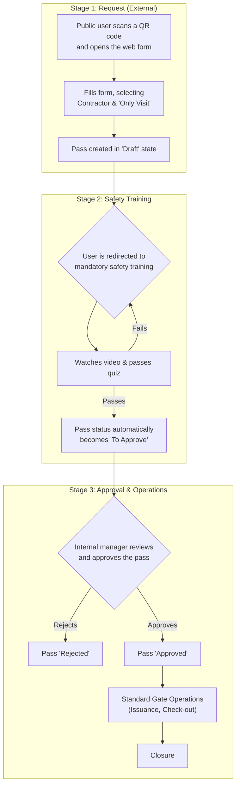
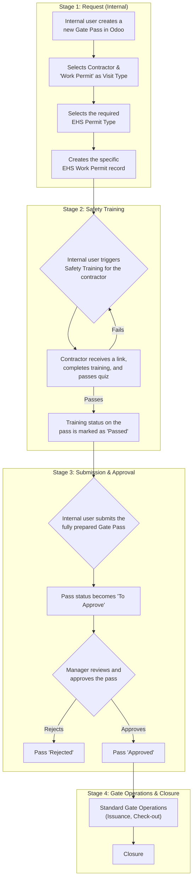

# Gate Pass Workflow: Visitor & Contractor Scenarios

This document provides a clear, stage-by-stage overview of the Gate Pass process. It explains how the `hr_gate_pass`, `hr_gate_pass_webform`, `safety_training`, and `hr_gate_pass_ehs_link` modules work together to create a complete security and safety workflow for different user scenarios.

---

## Scenario 1: Contractor Pass for "Visit" (External Public User)

This flow is for contractors making simple visits without performing on-site work. The process is initiated by a public user and is designed to be self-service.

### Visual Flowchart: Contractor (Visit)



### Detailed Stages: Contractor (Visit)

1.  **Request Initiation (External)**
    *   **Action**: A public user (contractor) scans a designated QR code, which opens the public Gate Pass Request web form. They fill out the form, selecting **Contractor** as the `Pass Type` and **Only Visit** as the `Visit Type`.
    *   **System Modules**: `hr_gate_pass_webform`
    *   **Result**: A Gate Pass record is created in the **Draft** state, and the user is immediately redirected to the safety training portal.

2.  **Mandatory Safety Training**
    *   **Action**: The contractor must watch a safety video and pass a quiz.
    *   **System Module**: `safety_training`
    *   **Result**: Upon passing the training, the Gate Pass status is automatically updated to **To Approve**.

3.  **Internal Approval**
    *   **Action**: A designated internal manager receives a notification and reviews the request.
    *   **System Module**: `hr_gate_pass`
    *   **Result**: The manager approves the pass, changing its status to **Approved**.

4.  **Gate Operations & Closure**
    *   **Action**: The security team issues the pass upon the contractor's arrival (`Issued`), scans it upon exit (`Returned`), and an admin finally closes the record (`Closed`).
    *   **System Module**: `hr_gate_pass`
    *   **Result**: The workflow is completed.

---

## Scenario 2: Contractor Pass for "Work Permit" (Internal User)

This flow is mandatory for contractors performing on-site work. It must be initiated by an internal employee to ensure all safety and EHS requirements are met.

### Visual Flowchart: Contractor (Work Permit)



### Detailed Stages: Contractor (Work Permit)

1.  **Request Initiation (Internal)**
    *   **Action**: An internal employee creates a new Gate Pass from the Odoo backend. They select **Contractor** as the `Pass Type` and **Work Permit** as the `Visit Type`.
    *   **System Module**: `hr_gate_pass`

2.  **EHS Permit Creation**
    *   **Action**: The internal user must then select the specific **EHS Work Permit Type** (e.g., *Hot Work*, *Work at Heights*) and create the corresponding EHS permit record.
    *   **System Module**: `hr_gate_pass_ehs_link`
    *   **Result**: An EHS permit is now linked to the Gate Pass. The pass cannot be submitted without this.

3.  **Mandatory Safety Training**
    *   **Action**: The internal user triggers the safety training, which sends a unique link to the contractor. The contractor completes the training and passes the quiz.
    *   **System Module**: `safety_training`
    *   **Result**: The `training_passed` field on the Gate Pass is marked as true.

4.  **Submission and Approval**
    *   **Action**: With the EHS permit created and training passed, the internal user submits the Gate Pass. It moves to the **To Approve** state for a manager's review.
    *   **System Module**: `hr_gate_pass`
    *   **Result**: The manager approves the pass, and its status becomes **Approved**.

5.  **Gate Operations & Closure**
    *   **Action**: The security team manages the pass issuance, check-out, and final closure, as in the standard flow.
    *   **System Module**: `hr_gate_pass`
    *   **Result**: The workflow is completed, ensuring full safety and EHS compliance.
```
